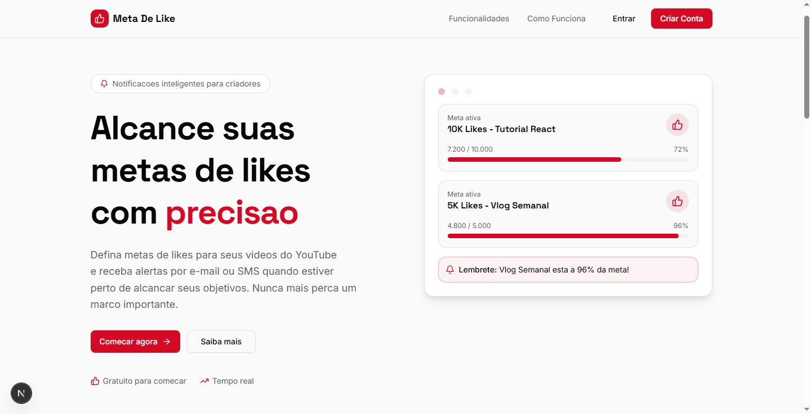
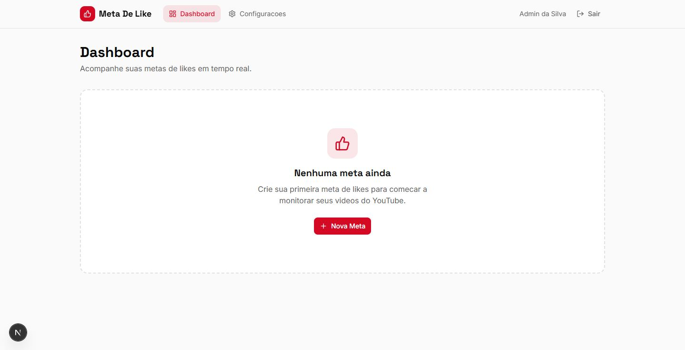
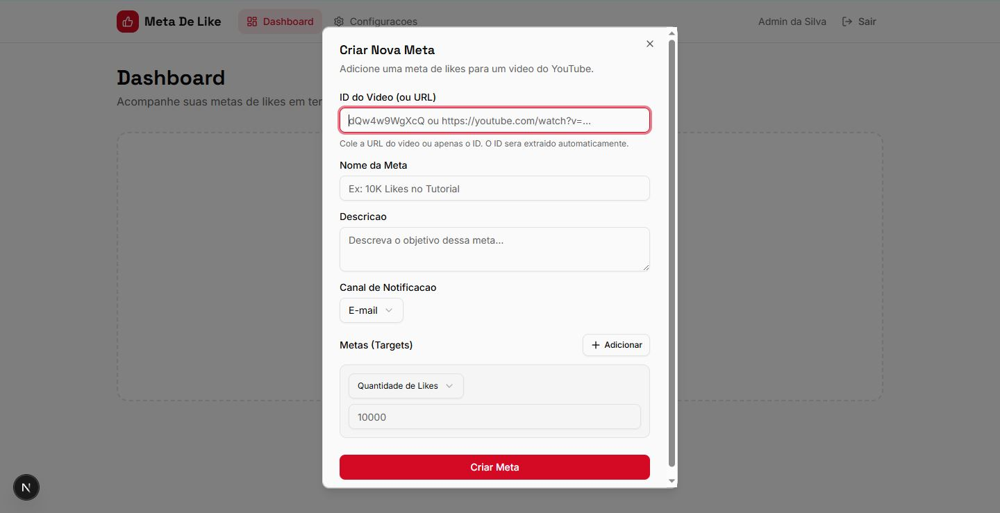
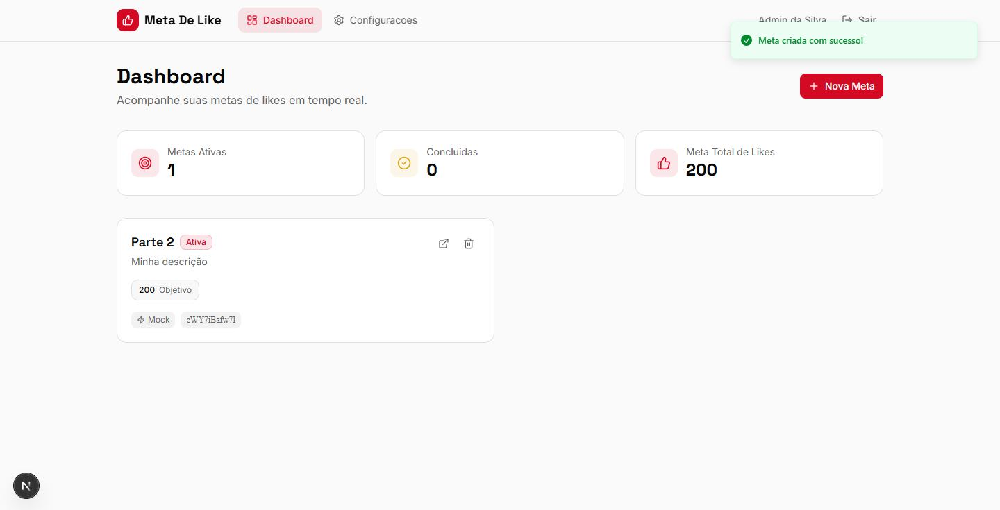

# YouTube Like Goal Notifier

Sistema que permite que criadores de conteúdo sejam **notificados quando um vídeo atinge uma meta de likes**.

A ideia vem de algo muito comum em vídeos do YouTube:

> "Se esse vídeo bater X likes eu faço parte 2."

Normalmente o criador precisa verificar manualmente se a meta foi atingida.  
Este projeto automatiza esse processo monitorando o vídeo e notificando quando a meta definida é alcançada.

---

# Índice

- [Sobre o projeto](#sobre-o-projeto)
- [Tecnologias utilizadas](#tecnologias-utilizadas)
- [Arquitetura](#arquitetura)
- [Sobre os endpoints automáticos](#sobre-os-endpoints-automáticos)
- [Limitações conhecidas](#limitações-conhecidas)
- [Como rodar o projeto](#como-rodar-o-projeto)
- [Screenshots](#screenshots)

---

# Sobre o projeto

Este projeto foi criado para automatizar o acompanhamento de metas de likes em vídeos.

O usuário pode:

- registrar um vídeo
- definir uma meta de likes
- receber notificação quando a meta for atingida

O objetivo principal do projeto foi **experimentar automação de APIs usando Spring e integração com serviços externos**.

---

# Tecnologias utilizadas

Backend:

- Spring Boot
- Spring Security
- Spring Data REST

Autenticação:

- Firebase Authentication

Frontend:

- Next.js

Outros:

- API do YouTube

---

# Arquitetura

A aplicação segue uma arquitetura simples baseada em API. O projeto utiliza uma estrutura **monorepo**.

O backend é responsável por:

- gerenciar usuários
- registrar metas
- monitorar vídeos
- disparar notificações

---

# Sobre os endpoints automáticos

Grande parte da API foi gerada automaticamente utilizando **Spring Data REST**.

Isso significa que muitos endpoints não foram escritos manualmente, mas sim gerados a partir dos repositórios.

Por causa disso:

- alguns endpoints podem parecer diferentes de APIs REST tradicionais
- algumas rotas podem não seguir exatamente a nomenclatura comum
- parte do comportamento é controlada automaticamente pelo framework

Essa abordagem foi utilizada para **reduzir código repetitivo e acelerar o desenvolvimento**.

---

# Limitações conhecidas

Como várias partes do sistema foram automatizadas, alguns problemas ainda existem:

- alguns fluxos podem apresentar bugs
- a estrutura dos endpoints pode parecer incomum
- parte da lógica depende de comportamento automático do Spring Data REST

Este projeto foi desenvolvido principalmente como **experimento técnico e estudo de arquitetura com Spring**.

---

# Como rodar o projeto

- Clone o repositório
- substitua secrets.example.yml em \goal-like\goal-like-backend\src\main\resources\ por secrets.yml com os valores preenchidos
- abre o run-dev.bat
- acesse no navegador: http://localhost:3000

---

# Melhorias futuras

- melhorar sistema de notificações
- refatorar alguns endpoints
- melhorar experiência do usuário
- adicionar testes automatizados
- melhorar integração com a API do YouTube

---

# Autor

Projeto desenvolvido como experimento para explorar:

- automação de APIs com Spring
- integração com autenticação externa
- monitoramento de métricas de conteúdo

---

# Screenshots

## Tela inicial

## Dashboard

## Config

## Meta

## Dashboard com Meta
